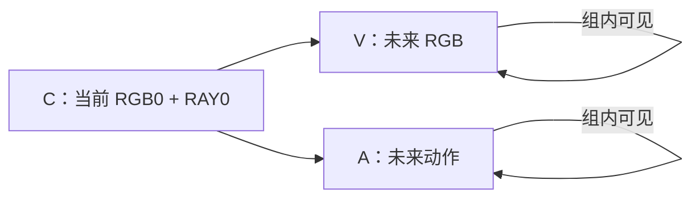
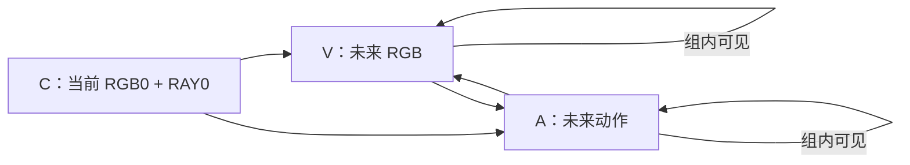

# 待补实验

用于记录待完成的实验、前置校验和结果。参数草案不代表已批准启动。

## 1. LIBERO 四个 suite 全绝对位姿全量微调

- **状态**：2026-09-20 正式全绝对缓存已由远端2卡切到GPU0/3/4/5/6/7六卡续算；训练和闭环评测尚未启动。
- **目标**：在 LIBERO spatial、object、goal、10 四个 suite 上，验证全绝对位姿 Rothko 表示的效果，并与已有方案在同等评测条件下比较。
- **表示**：RAY0 使用当前 EE 的绝对位姿，未来 16 步也使用绝对目标位姿；位置和朝向都采用全绝对表示。
- **模型**：Wan2.1 T2V 1.3B，全量微调 DiT；使用原始 VAE，冻结 encoder/decoder。
- **输入**：连续 17 帧，预测 16 步；双视角，每块 224×224，总画布 224×448。
- **归一化**：四个 suite 的全部训练数据，按当前 EE 与构造动作目标的 XYZ 极值、每侧加 1 cm 余量统计；center_frac=0.5。
- **动作语义**：沿用现有“当前 EE＋原始 action → 绝对目标”的构造；eval 时预测目标仍转换回 OSC 增量 action。零旋转命令下，构造目标可能不同于控制器内部目标，但未证明转换有误，不因此修改标签。

### 已有准备

- [训练配置](configs/task/libero_all4_rothko_all_absolute_2cam224_full_wan21_1_3b_1e-4.yaml)
- [评测配置](configs/sim_libero_all_absolute.yaml)
- [全绝对 codec](src/fastwam/representations/libero_rothko_all_absolute.py)
- [norm_stats 统计脚本](scripts/compute_libero_all_absolute_stats.py)
- [本机缓存／训练／评测统一入口](scripts/libero_all_absolute_workflow.py)（默认只打印命令，`--execute` 才运行）
- [本机操作说明](experiments/libero/ALL_ABSOLUTE_RUNBOOK.md)；[原始 VAE 小审计](scripts/audit_libero_all_absolute.py)
- stats：`data/libero_mujoco3.3.2/libero_all4_rothko_all_absolute_minmax_margin01_h16_224x448_centerfrac05.pt`
- 已完成 CPU 侧窗口时刻对应、位姿转换、直接 Rothko 编解码及相关回归检查。
- 本地审查记录：`evaluate_results/libero/all4_absolute_review_20260917/REVIEW_ZH.md`（实验产物被 Git 忽略）。

### 正式训练前待完成

- **必须先算新的全绝对缓存，再启动微调。** 顺序为：小规模重建与一致性校验 → 全量缓存 → 检查缓存完整性与身份 → 正式训练。
- **缓存脚本现状**：专用本机入口已准备，复用 [precompute_visual_action_latents.py](scripts/precompute_visual_action_latents.py)，通过新任务配置分别编码 RGB、Rothko；支持独立 256 窗口测速和 8 卡全量缓存。默认每 GPU 1 个进程、VAE batch8、每进程 DataLoader workers4；实际吞吐需先测速。原程序包含抽样在线／缓存逐位一致和固定噪声 loss 校验；2026-09-19 已在远端 A800 完成 256 窗口 GPU 校验，RGB/Rothko latent 与固定噪声 training_loss 逐位一致。
- **独立缓存目录**：`data/libero_all4_rothko_all_absolute_2cam224_wan21_bf16_h16_latents`；不覆盖旧缓存。正式全量缓存已在远端 A800 GPU0/3 启动：tmux `libero_all4_absolute_cache_2gpu`，每卡1进程、batch8/workers4、每shard1024窗口。日志 `evaluate_results/libero/all4_cache_2gpu_launch_20260919_164305/cache.log`。中断后可按相同契约与shard大小显式切8卡续算，不同时运行两组写进程。

- [x] 原始 VAE 重建审计：四-suite 共 74 个普通、极值、大旋转及尾部窗口；报告 `evaluate_results/libero/preflight_all4_20260919/REPORT.md`。
- [x] 256 窗口小缓存：抽查完整 RGB/Rothko latent（含 RAY0）与在线编码逐位一致，固定噪声 training_loss 一致；这是抽样检查。
- [x] 文本：发现旧 BF16 批量缓存与单条在线编码存在差异；已新建 `data/text_embeds_cache/libero_wan21_bf16_batch1`，40/40 在实际 `fastwam_libero` 环境逐位一致，最大绝对差为 0。实验 1 与继承该配置的实验 2 共用新缓存；原缓存和其他实验不变。报告 `evaluate_results/libero/text_batch1_20260919/verify.json`。
- 文本准备脚本：[prepare_libero_single_text_cache.py](scripts/prepare_libero_single_text_cache.py)，固定 batch=1，记录编码器/tokenizer SHA256，拒绝覆盖已有目录；后续换硬件、环境或权重后运行 verify。无需因此重算视觉 latent。
- [x] 用户已确认训练参数与 checkpoint 选择：沿用之前 Wan2.1 四-suite 训练，改为 8 卡 batch4/GA4；每 3000 步保存权重和完整 state，结束也保存；评测使用最终 checkpoint。
- [ ] 锁定模型、VAE、stats、数据、代码和配置指纹，计算独立的全绝对 latent 缓存；不直接复用相对／混合表示的 Rothko latent。
- [ ] 核对基线的模型、VAE、样本数、horizon、padding、decoder、seed 和 replan 设置，确定可比口径。

### 已确认参数与执行约束

- 训练：8 卡，每卡 batch 4，GA4，有效 batch 128；10 epoch，预计 21,700 个 optimizer steps（启动时按实际数据长度核对）。
- 学习率：1e-4；线性 warmup 占总步数 5%，预计 1,085 步；随后 cosine 降至 1e-6。
- 其他：BF16，关闭 gradient checkpointing；weight decay=0.01，梯度裁剪=1.0；RGB/Rothko loss 权重为 1/5。
- 训练内验证：每 1000 步一次，沿用 4 个窗口、20 次去噪。
- 保存：每 3000 个 optimizer steps 保存权重和完整 state，训练结束再保存；不额外启用每次验证前保存。预计保存 3000、6000、9000、12000、15000、18000、21000、21700 步。
- 正式评测使用最终 checkpoint，预计 step 21700；不根据闭环结果反复挑选 checkpoint。legacy decoder，anchor=0，20 次去噪，replan8，关闭 action ensemble，seed=42，每任务 50 个场景。
- 新全绝对方案继续使用原始 VAE。之前相对方案已有评测使用微调 VAE step7498，因此比较时须标明 VAE 差异，不能称为完全同条件。
- 实验 1 只进行一次正式 DiT 训练和一次 original VAE 闭环评测；先完成小规模链路校验。实验 3 是新增的微调 decoder 对照，复用同一 DiT，并额外评测一次；original VAE 结果直接复用实验 1。
- 当前配置没有独立 held-out 切分，训练内验证不能作为泛化结果。
- 不影响正在运行的 VLABench 训练及已有 LIBERO、LIBERO-Plus 实验。

### 本机代码准备与操作步骤（2026-09-18）

已按 `/mnt/hwdata/cfy/FastWAM` 的现有环境准备，尚未启动缓存、训练或评测；暂不做迁移包。

| 代码入口 | 用途 |
|---|---|
| `scripts/libero_all_absolute_workflow.py` | CPU 前置检查、VAE 小审计、8 卡缓存测速、全量缓存、缓存完成检查、正式训练、正式评测 |
| `scripts/audit_libero_all_absolute.py` | 四-suite GT → 原始 VAE → 动作重建审计，可传入指定窗口清单 |
| `tests/test_libero_all_absolute_workflow.py` | 检查默认不启动任务、测速与正式缓存分离、评测参数显式传递 |
| `experiments/libero/ALL_ABSOLUTE_RUNBOOK.md` | 更详细的运行说明；本文件保留实验决策和主要操作顺序 |

**默认只准备命令，不会启动 GPU 任务。** 以下 `audit / benchmark / cache / train / eval` 命令确认后加 `--execute` 才真正执行；`check / check-cache` 直接执行 CPU 检查。

```bash
cd /mnt/hwdata/cfy/FastWAM
PY=/mnt/hwdata/cfy/miniconda3/envs/fastwam/bin/python

# 1. 检查已确认的参数、四-suite 数据 metadata、stats 和原始 VAE 身份。
"$PY" scripts/libero_all_absolute_workflow.py check

# 2. 原始 VAE 小审计；默认每个 suite 首／中／末窗口。
"$PY" scripts/libero_all_absolute_workflow.py audit --gpus 0

# 3. 8 卡、256 个窗口的小缓存测速，写入独立诊断目录。
"$PY" scripts/libero_all_absolute_workflow.py benchmark

# 4. 全量缓存，必须在正式训练之前完成。
"$PY" scripts/libero_all_absolute_workflow.py cache

# 5. 检查完整缓存的身份、覆盖、shard 大小及一致性验证记录。
"$PY" scripts/libero_all_absolute_workflow.py check-cache

# 6. 正式训练：8 卡 batch4/GA4，10 epoch，每3000步及结束保存。
"$PY" scripts/libero_all_absolute_workflow.py train

# 7. 替换成实际完成的 run 路径，使用最终 step21700 做四-suite 评测。
"$PY" scripts/libero_all_absolute_workflow.py eval --run /absolute/path/to/completed_run
```

- 缓存默认每 GPU 1 个进程，VAE batch8、每进程 DataLoader workers4，可用 `--batch-size`、`--num-workers` 测速调整；这与训练 batch/GA 不同。
- 正式缓存约需 130 GiB 原始 shard 空间，另预留临时文件和 checkpoint 空间。测速缓存只覆盖开头 256 个窗口，不能用于正式训练。
- 默认 GPU 为 0–7；真正执行前检查 GPU 占用，不停止其他任务。新建输出目录，不覆盖旧结果，不隐式续跑。
- 执行记录与日志：`evaluate_results/libero/all4_absolute/launch_*`；训练使用独立的新 run 目录。正式运行可放在独立 tmux 会话中。
- 本轮已通过：CPU 配置／数据／stats／VAE 身份检查、8 项相关测试、评测 manager 与 worker 的实际配置解析。
- 更新（2026-09-19）：上述74窗口 VAE 审计、256窗口小缓存以及40条文本一致性检查已完成，见本节前置检查记录；正式全量缓存和8卡训练仍未启动。
- 本轮验证记录：`evaluate_results/libero/all4_absolute_local_prepare_20260918/`。

### 结果待填写

- Run / checkpoint：待填写。
- 四个 suite 分别成功率、总成功率及统计分母：待填写。
- 与同条件基线的差异：待填写。
- 失败样例、训练耗时与评测耗时：待填写。

## 2. LIBERO Goal：动作表示与 attention mask 消融

- **状态**：正式计划保留 Latent-Repeat、两种 attention mask 和完整基线。Flatten 与 Shuffled 已移除，不再为其生成训练缓存、训练 DiT 或闭环评测；已完成的离线 VAE 诊断仅作为记录保留。
- **范围**：所有组均只使用 LIBERO Goal suite 训练，并只在 Goal suite 测试。
- **数量**：三个消融加完整方案基线，共四组 DiT 训练；另加一组复用基线 DiT 的微调 VAE decoder 对照，合计五组闭环评测。
- **目的**：分别检验 Rothko 空间表示与未来 RGB/action token 之间 attention 连接方式的作用。

### 五组设置

| 编号 | 设置 | 相对完整方案的改动 |
|---|---|---|
| 2.1 | **Latent-Repeat** | 将归一化后的数值动作向量重复铺成 latent-frame tensor，直接作为动作 latent，绕过动作侧 visual VAE；RGB 路径保持一致。 |
| 2.2 | **Decoupled Mask** | 保留未来 RGB 与动作的联合监督，但在去噪期间禁止未来 RGB 与未来动作 token 双向直接互相 attention。 |
| 2.3 | **Bidirectional Mask** | 保留 Rothko 表示，允许未来 RGB 与 Rothko latent 之间双向、无额外限制的相互 attention。 |
| 2.4 | **Rothko + 当前 attention mask（完整方案基线）** | 使用当前 Rothko 表示与 `rgb_then_raymap_block_causal` mask，作为以上三组的共同参照。 |
| 2.5 | **2.4 + 微调 VAE decoder** | 复用 2.4 训练得到的最终 DiT checkpoint，仅在测试时换成微调后的 VAE decoder；与 2.4 对比 decoder 微调的作用。 |

Latent-Repeat 已对照本地 `third_party/cosmos-policy` 代码：采用相同的归一化数值 chunk 展开、repeat 填充 latent、预测后对重复 chunk 取均值的核心方法；动作时序布局适配 Wan，具体见下方。属于沿用该编码思想，并非完整复现 Cosmos Policy 的 backbone、序列布局和训练流程。

### 已确认的共同设置

- **四组均采用全绝对位姿、Wan2.1 T2V 1.3B，全量微调 DiT。**
- **训练参数沿用实验 1 的四-suite 设置，仅将训练数据换成 LIBERO Goal**：10 epoch，8 卡，每卡 batch4、GA4，有效 batch128；LR=1e-4，线性 warmup 5%，随后 cosine 到 1e-6。
- BF16，关闭 gradient checkpointing；weight decay=0.01，梯度裁剪=1.0，训练 seed=42；RGB/action loss 权重：**Latent-Repeat（2.1）按用户确认使用 1/1，不额外上调动作 loss；2.2–2.4 沿用 1/5**。
- 每 1000 个 optimizer steps 验证，每 **2000 步**保存权重和完整 state，结束也保存；闭环评测使用最终 checkpoint。
- 总步数按 Goal 数据量重新计算，不沿用四-suite 的 21,700 步。按当前 52,895 个窗口、有效 batch128 估算，每 epoch 414 步，10 epoch 共 **4,140 步**，warmup **207 步**；预计保存 step2000、step4000 与最终 step4140，启动时核对实际步数。
- **2.4 启动准备（2026-09-20，ainode06）**：用户已授权使用 GPU0–7，W&B 已登录。四-suite 完整缓存通过 `check-cache`；Goal 缓存由 `scripts/extract_libero_goal_absolute_cache.py` 精确复制全量缓存中的 `[120538,173433)`，不重新全量编码。复制后仍须运行原缓存脚本，检查首／中／尾 latent 与固定噪声 training_loss 逐位一致，再生成 `_SUCCESS`，之后才启动训练。参数及源码指纹记录在远端 `evaluate_results/libero/goal24_launch_20260920/`。此次仅训练 2.4，不启动其他消融或闭环评测。
- **2.4 启动记录（2026-09-20 02:50 UTC）**：Goal 缓存 52 个 shard、52,895 窗口、24.72 GiB 已完成；索引 `[0,26447,52894]` 的 RGB／Rothko latent 与在线编码逐位一致，固定 seed123456 的 training_loss 逐位一致（0.9586604237556458）。远端 tmux `libero_goal24_absolute_train`；run `runs/libero_goal_rothko_all_absolute_2cam224_full_wan21_1_3b_1e-4/2026-09-20_02-48-42`；启动与训练日志 `evaluate_results/libero/goal24_launch_20260920/train.log`。参数沿用上述已确认配置，8卡、10epoch、每2000步及最终保存权重和完整state。
- W&B 已确认在线同步：[bgkr0dm0](https://wandb.ai/chfanyang-xi-an-jiaotong-university-/fast-wam/runs/bgkr0dm0)。实际日志确认 world_size=8、GA4、full DiT、`max_steps=4140`。训练／验证底层 dataset 均为 Goal 52,895 窗口，定期验证仍是既定固定4窗口，不是独立 held-out 泛化评测。
- **2.4 正式评测（2026-09-20 11:13 UTC，ainode06）**：训练已到 step4140 正常结束，最终权重与完整state均保存。使用 `step_004140.pt` + 原始冻结 VAE，legacy/anchor0、seed42、replan8、20步去噪、不使用action ensemble，Goal 10任务×50场景，共500场景；8卡、每卡最多2任务，10任务同时运行。EGL双相机256×256渲染检查通过，manager/worker配置一致。启动目录 `evaluate_results/libero/goal24_eval_launch_20260920_111156`，结果目录 `evaluate_results/libero/goal24_step4140_original_replan8_ep50_20260920_111156`，外层tmux `libero_goal24_eval_manager`。仅启动评测，结果待完成后填写。
- **2.1–2.4 均不微调 VAE，统一使用 original Wan2.1 VAE 做测试。** 需要 VAE 的路径在 DiT 训练／缓存阶段也使用同一原始冻结权重；不使用 VAE7498 或其他微调 VAE。**2.5 是单独新增的 decoder 微调对照**，定义见下方，不改变 2.1–2.4 的设置。
- Latent-Repeat 已确认采用下述 Wan 适配方案，绕过动作侧 VAE；RGB 路径仍使用原始冻结 VAE。
- **闭环测试协议已确认：沿用此前 Goal suite 的既有协议，不另设新协议。** replan8、20 次去噪，每任务 50 个场景、seed42，关闭 action ensemble；各组使用相同场景与其他既有控制设置。2.1–2.4 使用 original VAE，2.5 使用微调 decoder；各表示的动作读取方式随消融定义确定。

### 2.5：复用 2.4 DiT + 微调 VAE decoder（新增）

- **2026-09-20 启动（ainode06，13:06 UTC）**：用户要求停止2.4闭环评测并启动8卡Goal-only VAE微调。停止时保留477个已完成场景、420次成功，另23个未完成，不能作为完整500场景成绩；快照 `evaluate_results/libero/goal25_vae_launch_20260920_130306/eval_at_stop.json`。Goal缓存契约通过，60个训练/验证、首/末完整/末尾padding probe均与原始BF16 encoder逐位一致。tmux `libero_goal25_vae_2ep`；启动记录 `evaluate_results/libero/goal25_vae_launch_20260920_130306/`；输出 `runs/libero_goal_all_absolute_decoder_wan21_bs2_ga4_lr1e-5_ep2/`。沿用本节既定参数和原四-suite min/max stats，不修改范围或数据。
- 启动确认：world_size=8，413训练/20验证episode，50,445训练窗口，1,578总步数，warmup78，conv2＋decoder共73,295,603个可训练参数；step10 loss=0.039871，初始约7.43秒/step。W&B新run：[i9lduff0](https://wandb.ai/chfanyang-xi-an-jiaotong-university-/fast-wam/runs/i9lduff0)。

- 固定使用 **2.4 的最终 DiT checkpoint**，不新增一次 DiT 训练。
- 对同一 Goal 全绝对 Rothko 表示微调 VAE decoder，encoder 保持原始冻结权重；测试时搭配该 VAE 与 2.4 的 DiT。
- 仅用 Goal 训练数据进行 decoder 微调，不用闭环测试结果或测试场景数据拟合。
- 闭环协议与 2.4 完全相同，包括测试场景／seed、replan8、20 次去噪和动作处理；对比 original VAE 与微调 decoder 的差异。
- **用户已确认 decoder 微调沿用之前 LIBERO Wan2.1 的做法与参数。** 依据为 `runs/libero_rothko_vae_decoder_wan21_all4_centerfrac05_h16_bs2_ga8_lr1e-5_ep2/experiment_config.json` 和 `training_config.json`；本组仅换成 Goal 数据、全绝对 Rothko codec 和对应 stats，不直接复用旧相对表示或 VLABench 的微调 VAE。
- 从 original Wan2.1 VAE 初始化，冻结 encoder，训练 **conv2＋decoder**；输入为 **GT Rothko → 原始冻结 encoder 得到的 latent**，重建 GT Rothko，不改用 DiT 生成 latent。
- 训练参数沿用：**2 epoch、LR=1e-5、cosine、warmup 5%、最低 LR 比例 0.01、weight decay=0、梯度裁剪=1**；FP32 master 参数／梯度／AdamW 状态，BF16 autocast，分片优化器。
- **本组按用户确认使用 8 卡微调 decoder，每卡 batch2、GA4，有效 batch64**；历史配置为 4 卡、每卡 batch2、GA8，因此通过减半 GA 保持有效 batch 与其余训练参数一致，不套用 DiT 的 batch4/GA4。
- Loss 沿用中心／方向／夹爪区域 masked L1，权重 **1/1/1**；使用本次全绝对表示的 GT 图与匹配区域。
- 数据划分沿用每任务留出 2 个 episode、split_seed=20260801；验证 `uniform_per_episode`、每 episode 10 窗口、eval_batch1、eval_seed12345；训练 seed42。
- 保存与验证沿用 decoder 原规则：每400步保存 latest，每800步保存 step checkpoint、导出 VAE并验证，epoch 结束验证，训练结束保存并导出；测试用最终导出的 VAE。这里不套用 2.1–2.4 的 DiT 每2000步保存规则。
- 用户已确认包含尾部 edge-repeat padding；补齐帧参与重建 loss，验证动作误差排除补齐步。Goal 总50,445个训练窗口，789步/epoch，2epoch共1,578步，warmup78步。
- 状态：已列入计划，尚未启动 decoder 微调或评测。

### Goal 全绝对 decoder 代码准备（实验 2.5，2026-09-19）

- 已准备独立配置：`configs/vae/libero_goal_all_absolute_decoder_wan21_bs2_ga4_lr1e-5_ep2.json`；入口：`scripts/prepare_goal_absolute_decoder.py`；操作说明：[GOAL_ABSOLUTE_DECODER_RUNBOOK.md](experiments/libero/GOAL_ABSOLUTE_DECODER_RUNBOOK.md)。仅准备和CPU校验，未启动GPU审计、缓存、训练或评测。
- 按历史split、用户新增的尾部edge-repeat规则，固定训练413个episode、50,445窗口；验证20个episode、200窗口。8卡有效batch64，789步/epoch，2epoch总1,578步，warmup78步。
- 固定训练/验证episode、验证starts、训练缓存索引及身份：`evaluate_results/libero/goal_absolute_decoder_preparation_padding_20260919/manifest.json`。
- 复用待生成的Goal全绝对DiT缓存时，先检查数据契约、原始VAE哈希、stats、BF16精度、latent尺寸、完整性和缓存验证标记，再做60个覆盖每任务训练/验证首个、最后完整和最终padding窗口的GPU逐位一致性检查。当前缓存不存在，正式训练入口要求匹配的审计报告。
- 保存规则补充：历史trainer在epoch结束也保存latest，因此预计latest恢复点为400、789、800、1200、1578；独立权重checkpoint与VAE导出为800、最终1578；验证为789、800、1578。独立历史checkpoint不含优化器，续训使用latest。
- 验证使用原始冻结encoder缓存和BF16部署精度decoder、全绝对legacy/anchor0读取。旧相对目标/解码不参与本入口。公共训练文件与正在运行的VLABench任务未修改。
- 已新增尾部重复、当前RAY0及验证padding过滤检查，共6项CPU检查；实际缓存逐位一致、GPU训练/验证/恢复仍待缓存生成后测试。GPU阶段默认只打印命令，不自动开跑。

### 控制变量与实现前需锁定的细节

- 表示消融（2.1）沿用基线 mask；mask 消融（2.2–2.3）沿用基线 Rothko 表示。
- 四组使用同一 Goal 数据范围、窗口采样、horizon、位姿目标语义、归一化物理范围、RGB 输入与条件信息。
- 四组统一模型初始化、训练预算、有效 batch、优化器、学习率计划、训练 seed，以及最终 checkpoint 选择规则，按上面的已确认设置执行。Latent-Repeat 的 action loss 权重另按用户确认设为 1，其他组为 5；因此该组对比同时涉及表示和动作 loss 权重，不能表述为严格只改变表示。
- 四组闭环测试场景、seed、每任务 episode 数、replan、去噪步数和夹爪处理均沿用上述已确认的既有 Goal 协议；报告 Goal 各任务及整体成功率与分母。
- Latent-Repeat 的位姿语义、数值铺排和读取规则按下述定义执行。
- Latent-Repeat 的向量、布局和读取方案已确认，见下方；实现时核对训练目标、当前条件和推理读取使用同一规则。
- 两种 mask 的连接定义已确认，见下方矩阵；实现时需检查每层都保持条件 token 不读取未来，避免 Decoupled 经条件 token 间接交换信息。
- RGB 与动作均保留监督；Latent-Repeat 使用 RGB/action 权重 1/1，保留 Wan 基线扩散目标与分模态求均值方式，不额外做 latent 方差匹配。其动作 latent 尺度与 VAE latent 不同，不能直接用不同表示间的原始 loss 大小评价优劣。

### Latent-Repeat：Cosmos 思想的 Wan 适配（已确认）

- **Loss 已确认**：RGB/action 权重为 **1/1**，即 `loss_rgb + loss_action`，不将 action loss 乘 5；保留 Wan 的扩散训练目标、噪声／时间权重和分模态求均值方式，不额外做 latent 方差匹配。参考本地 Cosmos Policy 默认 `action_loss_multiplier=1`，但不声称完整复现其 EDM loss 或整体聚合方式。

- 保留基线 `[rgb0–4 | ray0–4]` latent 布局和 attention mask，不缩减未来动作 latent 帧数；每个动作 latent 帧形状为 `[16,28,56]`，共 25,088 个标量。
- 使用归一化8维绝对动作向量 `[x,y,z,qw,qx,qy,qz,gripper]`：XYZ 按基线绝对位置 bounds 线性映射到 `[-1,1]`；四元数归一化为单位四元数；gripper 从 `[0,1]` 映射到 `[-1,1]`。不再套用 VAE latent 均值／标准差变换。
- 四元数逐帧统一符号：令 `qw >= 0`；若 `qw == 0`，令 `(qx,qy,qz)` 中第一个非零分量为正，不采用随窗口变化的符号选择。该约定不保证跨180°时分量连续。读取后重新归一化，范数接近零时须有数值保护并记录退化样本。
- `ray0`：当前 EE 位姿和当前 gripper，8 维向量 repeat 3,136 次，按 CHW reshape 为 `[16,28,56]`；作为干净条件，不包含未来动作。
- `ray1`：未来动作第 1–4 步；`ray2`：第 5–8 步；`ray3`：第 9–12 步；`ray4`：第 13–16 步。这里是显式动作分组，不声称等同于 VAE 的时间感受野。
- 每个未来 latent 帧先将 `[4,8]` 动作按时间顺序展开成 32 个标量，repeat 784 次，再按 CHW reshape 为 `[16,28,56]`。latent 帧直接整体填充，不执行图像 HWC 排列或双 tile 复制。
- 动作侧不经过 VAE encoder/decoder；RGB 仍沿用基线 VAE 编码。DiT 训练、噪声与采样保持 Wan 原有流程，不移植 Cosmos 的扩散参数化。
- 读取：分别展开生成的 ray1–4，每帧 reshape 为 `[784,4,8]`，沿 784 份重复取均值，再按时间拼回 `[16,8]`；按相同规则反归一化 XYZ、归一化四元数、恢复 gripper，最后沿用现有绝对目标到 OSC action 的转换。
- 源码依据：`cosmos_policy/models/policy_text2world_model.py::replace_latent_with_action_chunk` 和 `cosmos_policy/experiments/robot/cosmos_utils.py::extract_action_chunk_from_latent_sequence`。Cosmos 原实现把整个动作 chunk 铺入一个 latent 帧，必要时编码截断尾部、读取丢弃不完整重复；本实验 8 维／4 步尺寸正好整除，无需截断。

### 已归档：Action Representation 原始 VAE round trip 小诊断（2026-09-19）

- 已在本机完成，未启动消融训练；独立脚本：`scripts/audit_goal_representation_roundtrip.py`。
- Goal 10 个任务各随机抽 2 个 episode，每个随机取 1 个窗口，共 20 窗口，seed42；三组共用样本。原始 Wan2.1 VAE、BF16、17 帧、224×448、batch1；排除 padding，前8步156个有效目标、全部16步302个有效目标。
- Flatten-Resize 按已确认的 HWC 数值重复；Shuffled 在单 tile 内固定置换 RGB 像素后复制两份，解码后分别逆置换。置换可逐位还原。
- 前8步 GT→VAE→动作误差如下（均值 / P95）：

| 表示 | 平移 L2（mm） | 旋转（°） | 夹爪二值错误率 |
|---|---:|---:|---:|
| Rothko | 9.453 / 18.279 | 0.896 / 1.715 | 0% |
| Flatten-Resize HWC | 256.837 / 454.092 | 113.359 / 147.894 | 12.82% |
| Shuffled Rothko | 281.774 / 406.751 | 49.855 / 102.542 | 0.64% |

- 全16步平移／旋转均值：Rothko 9.117 mm / 0.852°；Flatten 267.337 mm / 111.513°；Shuffled 283.210 mm / 44.703°。
- 三组直接编解码误差接近零；仅 BF16 像素量化时平移均值均约0.580 mm，旋转均值 Rothko/Shuffled约0.00062°、Flatten约0.0364°。这批样本的大幅误差出现在 VAE round trip，不能归因于 DiT 未学好。
- 这是小样本 GT 重建诊断，并非闭环成功率；表示消融同时受到原始冻结 VAE 对空间组织的适配性影响，不能单独据此推断 DiT 学习难度。现已移除这两组正式训练和闭环评测，仅保留此离线诊断。
- 明细、采样窗口及固定置换：`evaluate_results/libero/representation_roundtrip_20260919/`（report.json、rows.json、selection.json、permutation.pt）。诊断 CUDA 峰值 allocated 1.235 GiB；现有 VLABench VAE 训练持续推进。

### 已归档：Flatten-Resize CHW 补充诊断（2026-09-19）

- 历史加测 CHW；HWC 和 CHW 均不再列入正式训练计划。与上述20窗口完全相同，仅把单tile的 repeat 后 reshape 改为 `[3,224,224]`，读取同步按CHW展开；仍复制双tile、使用原始BF16 VAE。
- 独立逐元素布局及直接往返校验通过；实际有效16步直接解码最大平移0.000258 mm、旋转0.0000248°，夹爪误差0。
- 前8步 VAE round trip：平移均值/P95 **215.920 / 396.150 mm**，旋转 **92.829 / 144.611°**，夹爪二值错误率 **16.03%**。
- 全16步：平移均值/P95 **215.773 / 382.248 mm**，旋转 **90.494 / 123.257°**，夹爪二值错误率 **17.55%**。
- CHW 的平移/旋转误差低于这批样本的HWC，但仍严重失真；夹爪二值误差更高。改变铺排顺序没有解决原始VAE的重建问题。
- 报告：`evaluate_results/libero/representation_roundtrip_chw_20260919/report.json`；运行命令在原诊断脚本上加 `--chw-only`。当时暂停的100 episode方案后续已由50 episode诊断替代。

### 已归档：50 个完整 episode 三表示 round trip（2026-09-19，已完成）

- 用户确认：Goal 每任务随机选5个完整episode，10任务共50个，seed42；遍历所选episode的所有frame starts，共 **6,472窗口**。本次三组为 **Rothko、Flatten-Resize CHW、Shuffled Rothko**，不是闭环policy评测。
- 原始Wan2.1 VAE、BF16、batch1；每组均测直接编解码、BF16像素量化、VAE round trip。前8/16步排除padding，汇总全体及每任务均值/P95/max、夹爪误差，记录四元数退化次数。
- 本机8卡各一个诊断进程，按完整episode分片，每卡784–869窗口，PyTorch显存分配上限15%；与VLABench VAE训练共享GPU，可能降低训练吞吐，不修改或停止训练。
- 脚本：`scripts/audit_goal_representation_episodes.py`；tmux：`goal_repr_roundtrip_50ep`。
- 输出：`evaluate_results/libero/goal_repr_50episodes_chw_20260919/`，采样在manifest.json，逐窗口9条记录保存在各shard的episode JSONL，progress.json记录进度，结束自动验证全部窗口/三表示/三链路覆盖后生成report.json及逐任务汇总。
- 此处比例以重叠窗口中的有效预测步为分母，不是独立物理时刻比例或闭环成功率。此前100-episode方案已由本次50-episode方案替代。

- **完成结果**：50 episode / 6,472窗口全部通过覆盖校验，8卡分片最长运行37.92分钟；前8步50,376、全16步97,552个有效目标，无四元数退化。
- 前8步（平移均值/P95 mm；旋转均值/P95 °）：Rothko **9.784/19.487；0.840/1.646**；Flatten CHW **246.962/518.505；86.621/135.263**；Shuffled **287.994/508.096；49.030/99.043**。
- 全16步均值：Rothko **9.636 mm / 0.799°**；Flatten CHW **244.668 mm / 86.641°**；Shuffled **286.869 mm / 47.079°**。前8步夹爪二值错误率分别 **0%、17.09%、0.35%**。
- 三组直接编解码最大误差均小于 **0.000366 mm / 0.000044°**，夹爪误差0。严重VAE重建误差在10个任务上均存在。
- 完整总体/逐任务结果：`evaluate_results/libero/goal_repr_50episodes_chw_20260919/SUMMARY.md` 与 `report.json`。未启动任何消融DiT训练或闭环评测。

### 两种 attention mask（已确认）

令 C 为当前 RGB0 与 RAY0 条件，V 为未来 RGB tokens，A 为未来 Rothko/action tokens。箭头表示信息从来源传向读取方；V、A 各组内部均全连接，C 内部保持当前实现的相互可见。文本 cross-attention 保持不变。

**Decoupled Mask：** V 和 A 都读取 C，但不能互相读取；C 不读取任何未来 tokens，避免跨层通过 C 间接交换信息。保留两种模态的预测与监督。



**Bidirectional Mask：** 在相同条件连接上开放 V 与 A 的双向连接；两组未来 tokens 合起来全连接。C 仍不读取未来 tokens。



当前完整基线为 V → A 的单向信息流（动作可读取未来 RGB，未来 RGB 不读取动作）。因此 Decoupled 去掉这一方向，Bidirectional 在基线上再加入 A → V。这里改变的是联合 token 序列的 self-attention mask，不是另加一个 cross-attention 模块；每层、每次去噪保持该连接约束。

用户已确认以下精确矩阵。行是 Query（读取方），列是 Key（被读取方）；1=允许，0=禁止。rgb0、ray0 为当前条件，1–4 为未来 latent 帧。每个帧级矩阵元素展开成对应帧的全部空间 token 之间的连接；文本 cross-attention 保持原样。

**Decoupled Mask**

```text
       rgb0 rgb1 rgb2 rgb3 rgb4 | ray0 ray1 ray2 ray3 ray4
rgb0     1    0    0    0    0 |   1    0    0    0    0
rgb1     1    1    1    1    1 |   1    0    0    0    0
rgb2     1    1    1    1    1 |   1    0    0    0    0
rgb3     1    1    1    1    1 |   1    0    0    0    0
rgb4     1    1    1    1    1 |   1    0    0    0    0
--------------------------------------------------------
ray0     1    0    0    0    0 |   1    0    0    0    0
ray1     1    0    0    0    0 |   1    1    1    1    1
ray2     1    0    0    0    0 |   1    1    1    1    1
ray3     1    0    0    0    0 |   1    1    1    1    1
ray4     1    0    0    0    0 |   1    1    1    1    1
```

**Bidirectional Mask**

```text
       rgb0 rgb1 rgb2 rgb3 rgb4 | ray0 ray1 ray2 ray3 ray4
rgb0     1    0    0    0    0 |   1    0    0    0    0
rgb1     1    1    1    1    1 |   1    1    1    1    1
rgb2     1    1    1    1    1 |   1    1    1    1    1
rgb3     1    1    1    1    1 |   1    1    1    1    1
rgb4     1    1    1    1    1 |   1    1    1    1    1
--------------------------------------------------------
ray0     1    0    0    0    0 |   1    0    0    0    0
ray1     1    1    1    1    1 |   1    1    1    1    1
ray2     1    1    1    1    1 |   1    1    1    1    1
ray3     1    1    1    1    1 |   1    1    1    1    1
ray4     1    1    1    1    1 |   1    1    1    1    1
```

### 两种 mask 的代码准备（2026-09-19）

- 已实现独立模式：Decoupled 为 `rgb_raymap_decoupled`，Bidirectional 为 `rgb_raymap_future_bidirectional`。当前 `rgb_then_raymap_block_causal` 分支及所有旧模式保持原样；不修改默认模型配置。
- 新模式都要求成对的 `[RGB0–4 | RAY0–4]` 布局、条件索引 `(0,5)`，条件只读取条件。Bidirectional 仅开放未来两组之间的连接，不使用原有允许条件读未来的 `bidirectional` 模式。
- 三组 Goal 专用配置：
  - 基线（2.4）：`configs/task/libero_goal_rothko_all_absolute_2cam224_full_wan21_1_3b_1e-4.yaml`
  - Decoupled（2.2）：`configs/task/libero_goal_all_absolute_mask_decoupled_wan21.yaml`
  - Bidirectional（2.3）：`configs/task/libero_goal_all_absolute_mask_future_bidirectional_wan21.yaml`
- 两个消融配置继承 Goal 基线，仅覆盖 mask、输出目录和运行名称。Goal 基线继承四-suite 全绝对配置，限定 Goal 数据并改为每2000步保存；全绝对 stats、原始 VAE、RGB/action 1:5、10epoch、batch4/GA4 和每1000步验证均保持已确认设置。
- 三组指向同一份待生成的 Goal 全绝对缓存：`data/libero_goal_rothko_all_absolute_2cam224_wan21_bf16_h16_latents`。没有生成缓存、启动训练或执行闭环评测；不能用不同表示的旧缓存替代。
- 两种模式均通过现有公共 forward 将 mask 传入每一层，训练与去噪复用同一路径；不增加模型参数。现有 checkpoint 元数据保存 mask 模式，加载时已有的不一致检查继续生效。
- CPU检查：精确10×10矩阵、空间token展开、非法布局拒绝、三层真实DiT输入扰动验证条件/分支隔离及允许的信息流、反向传播有限梯度、Hydra完整配置对比。测试：`tests/test_goal_attention_mask_ablation.py`；记录：`evaluate_results/libero/goal_mask_implementation_20260919/`。
- 2026-09-19 已在远端 A800 GPU0/3 完成两种 mask 的真实 Goal 窗口 GPU 检查（index26447、batch1、BF16、无 optimizer 更新）：缓存/在线 training_loss 逐位一致，完整 DiT 反向传播梯度有限、VAE 冻结；20步去噪返回有限的 `[1,17,7]` 位姿与 `[1,17,1]` 夹爪。每进程反向峰值 allocated 约21.83 GiB。报告：`evaluate_results/libero/goal_mask_gpu_20260919/{decoupled_v2,bidirectional_v2}/report.json`。这不替代正式 batch4/GA4 的8卡 optimizer/保存恢复验证，也不代表任务成功率。

### 执行顺序

- [x] 确认全绝对位姿、Wan2.1 1.3B、共同训练参数、原始冻结 VAE 和最终 checkpoint 规则。
- [x] 确认闭环测试沿用此前 Goal 协议，replan8、20 次去噪。
- [x] 确认 Decoupled / Bidirectional 的上述精确连接矩阵。
- [x] 确认 Latent-Repeat 使用 Cosmos 的数值重复／均值读取思想，保留 Wan ray0–4 布局，四个未来帧各承载 4 步动作。
- [x] 实现两种独立 mask 配置与 CPU 矩阵、跨层信息流和反向传播检查。
- [ ] 实现 Latent-Repeat 独立配置及往返、尺寸／尺度检查。
- [x] 两种 mask 的 GPU 小规模前向/反向、单窗口缓存读写一致性与20步推理链路检查（batch1；全量缓存与正式8卡训练尚未执行）。
- [ ] **先准备各表示所需的新缓存，再训练。** RGB 缓存仅在身份和数据契约一致时复用；动作表示不同不能冒用同一动作缓存。Mask 消融与基线可在契约一致时共享表示缓存。
- [ ] 分别执行 2.1–2.4 的四组 Goal-only DiT 训练与闭环测试，不影响已有实验。
- [x] 确认 2.5 的 conv2＋decoder 微调沿用之前 LIBERO Wan2.1 decoder 参数与 GT 重建方式。
- [ ] 完成 2.5 的 Goal 全绝对 decoder 微调，复用 2.4 的最终 DiT checkpoint，按同一 Goal 协议追加测试。
- [ ] 汇总成功率、训练／推理成本和代表失败案例；离线动作误差作为辅助指标，不以不同表示的训练 loss 代替任务成功率。

### 结果待填写

| 设置 | Run / checkpoint | Goal 成功数／总数 | 成功率 | 训练／测试耗时 |
|---|---|---|---|---|
| Latent-Repeat | 待填写 | 待填写 | 待填写 | 待填写 |
| Decoupled Mask | 待填写 | 待填写 | 待填写 | 待填写 |
| Bidirectional Mask | 待填写 | 待填写 | 待填写 | 待填写 |
| Rothko + 当前 attention mask | 待填写 | 待填写 | 待填写 | 待填写 |
| 2.5：2.4 DiT + 微调 VAE decoder | 复用 2.4 DiT；VAE checkpoint 待填写 | 待填写 | 待填写 | 待填写 |


## 3. 适配实验 1 的 LIBERO 四个 suite decoder 微调

- **状态**：专用配置、固定切分/缓存索引、审计和训练入口已准备，CPU检查通过；缓存尚未生成，GPU审计、训练及评测尚未启动。
- **目标**：为实验 1 的四-suite 全绝对位姿方案微调 VAE，比较同一 DiT 搭配 original VAE 与微调 decoder 的效果。
- **数据与表示**：使用 LIBERO spatial、object、goal、10 四个 suite；沿用实验 1 的全绝对 RAY0 和未来目标、17 帧／16 步、224×448 Rothko，以及同一份四-suite 全绝对 norm_stats。与 2.5 的 Goal-only decoder 分别训练和保存。
- **训练方式**：从 original Wan2.1 VAE 初始化，冻结 encoder，仅训练 **conv2＋decoder**；GT Rothko 经原始冻结 encoder 得到 latent，再重建 GT Rothko。其余做法沿用此前 decoder 微调。
- **训练参数**：**8 卡、每卡 batch2、GA4，有效 batch64；2 epoch、LR=1e-5、cosine、warmup 5%、最低 LR 比例 0.01、weight decay=0、梯度裁剪=1**。FP32 master 参数／梯度／AdamW 状态，BF16 autocast，分片优化器。
- **Loss**：中心／方向／夹爪区域 masked L1，权重 1/1/1，使用本次全绝对 GT 图和匹配区域。
- **划分与验证**：每任务留出 2 个 episode，split_seed=20260801；训练 seed42；验证 uniform_per_episode、每 episode 10 窗口、eval_batch1、eval_seed12345。仅用训练部分拟合 decoder。
- **保存与验证频率**：每400步保存 latest，每800步保存 step checkpoint、导出 VAE并验证，epoch 结束验证，结束保存并导出；测试使用最终导出的 VAE。总 steps 与 warmup 按实际训练窗口数重新计算。
- **尾部 padding（已确认）**：遍历训练episode全部frame starts，未来目标不足16步时edge-repeat最后动作；补齐帧参与重建loss，验证动作误差排除padding。按固定split共1,632个训练episode、264,409个窗口；8卡有效batch64，4,132步/epoch，2epoch共8,264步，warmup413步。四-suite专用入口已按此规则实现，不改历史公共trainer的默认无padding枚举。
- **缓存**：先核对 decoder 的窗口采样、padding、精度和 encoder 输入契约；仅在完全一致时复用实验 1 的原始 VAE 缓存，否则生成独立缓存，不覆盖已有缓存。
- **闭环评测**：复用实验 1 的最终 DiT checkpoint，仅换成此处微调的 VAE，encoder 保持原始冻结权重。四个 suite 均沿用实验 1 的场景、seed、每任务 50 次测试、replan8、20 次去噪及动作解码／控制设置。

### 已准备的代码与检查（2026-09-19）

- 配置：[libero_all4_all_absolute_decoder_wan21_bs2_ga4_lr1e-5_ep2.json](configs/vae/libero_all4_all_absolute_decoder_wan21_bs2_ga4_lr1e-5_ep2.json)。
- 独立入口：[prepare_all4_absolute_decoder.py](scripts/prepare_all4_absolute_decoder.py)，提供 `prepare / check-cache / audit / train`；GPU阶段默认只打印命令，必须显式 `--execute`。
- 操作说明：[ALL4_ABSOLUTE_DECODER_RUNBOOK.md](experiments/libero/ALL4_ABSOLUTE_DECODER_RUNBOOK.md)。
- 固定清单：`evaluate_results/libero/all4_absolute_decoder_preparation_padding_20260919/manifest.json`，包含训练/验证episode、800个验证窗口、264,409个训练缓存索引，以及配置/VAE/stats/数据契约身份。
- 缓存索引按实验1的spatial/object/goal/10顺序拼接，以dataset_root与episode ID共同标识样本；CPU已核对与实验1缓存契约一致。实际缓存目前不存在。
- 独立入口包含尾部edge-repeat、缓存训练、BF16部署解码验证及总体/逐suite前8/16步指标；验证动作误差排除padding，补齐帧参与训练重建loss。恢复要求完整优化器状态与匹配的数据/配置/缓存身份。
- 保存latest：每400步、epoch结束4132、最终8264；独立权重checkpoint/VAE导出：每800步及最终8264；验证：每800步和epoch结束。历史独立权重checkpoint不含优化器，完整续训用latest。
- **12项CPU测试通过**：6项四-suite新增检查，加6项Goal回归；覆盖40任务首尾窗口编解码、固定split、尾部padding、suite间同号episode防混淆、实验1缓存契约、配置与默认不启动GPU。记录：`evaluate_results/libero/all4_absolute_decoder_preparation_padding_20260919/cpu_tests.log`。
- 公共trainer、Goal专用入口和当前VLABench训练未修改。GPU训练/验证/恢复尚未实际测试，不以CPU检查替代。

### 待完成

- [x] 准备四-suite 全绝对 decoder 专用配置、固定数据划分与缓存契约检查入口。
- [ ] 实验1缓存完成后执行实际缓存检查与240个GPU逐位一致性probe。
- [x] GPU 单卡组件检查：encoder/conv1 冻结、conv2＋decoder 反向与 FP32 AdamW 更新、尾部padding参与loss、BF16部署解码有限；确定性设置下保存恢复后下一步 loss/权重逐位一致。仅单个末尾窗口、batch1/GA1，不替代完整验证集重建误差审计或8卡分片优化器续训测试。
- [ ] 完成 decoder 微调，独立保存 run、配置与最终 VAE 权重。
- [ ] 固定实验 1 最终 DiT，比较原始 VAE 与微调 decoder，报告各 suite 和整体成功数／总数、成功率及耗时。

| 设置 | DiT checkpoint | VAE checkpoint | spatial | object | goal | 10 | 整体成功率 |
|---|---|---|---|---|---|---|---|
| 实验 1：original VAE | 实验 1 最终 checkpoint | original Wan2.1 VAE | 待填写 | 待填写 | 待填写 | 待填写 | 待填写 |
| 实验 3：微调 conv2＋decoder | 同上 | 本实验最终 VAE，待训练 | 待填写 | 待填写 | 待填写 | 待填写 | 待填写 |

### 2026-09-19：远端两张 A800 的补充 GPU 检查

- 已按用户授权只用远端 GPU0/3，诊断目录 `evaluate_results/libero/goal_mask_gpu_20260919`；本机同步报告和脚本，未同步临时 checkpoint/latent 文件。完整报告见该目录 `REPORT.md`。未启动正式训练或全量缓存。
- 两种 mask：真实 Goal index26447、batch1、完整1.3B DiT、BF16；完整梯度检查、缓存/在线 loss 逐位比对和20步推理通过。诊断没有 optimizer 更新。
- Goal decoder（2.5）与四-suite decoder（3）：分别用末帧 index52894/277712，各含15个padding未来步，做2次单卡 FP32 AdamW 更新和一次恢复重放。保存权重/optimizer/scheduler/RNG；encoder/conv1不变，梯度有限、BF16部署解码有限。确定性计算设置下恢复后下一步 loss 和参数逐位一致。
- 默认非确定性计算下，恢复前后 loss 相同，参数最大差为 Goal 3.33e-8、四-suite 8.38e-9；确定性复核消除差异。正式训练配置未启用或修改确定性设置。
- 这些是 batch1/GA1、单卡非分片优化器组件检查，不能代替8卡 batch2/GA4 的 sharded optimizer、DataLoader/完整训练入口续训验证。缓存完成后还需各自60/240个正式逐位probe以及全验证集审计。

### 2026-09-20：四-suite缓存切六卡续算

- 用户授权使用远端GPU0/3/4/5/6/7，不使用GPU1/2。先停止原两卡全部进程，再清理2个未完成partial文件；227个完整shard（232,448窗口）保留，剩余45个shard。
- 同一输出目录、原始VAE、BF16、每进程batch8/workers4、每shard1024保持不变。底层缓存脚本检查原metadata后将剩余shard分配给6个rank。
- tmux：`libero_all4_absolute_cache_6gpu`。启动/清理记录、原metadata快照和日志：`evaluate_results/libero/all4_cache_6gpu_resume_20260920_013001/`。最终仍需通过latent逐位与training_loss一致性校验才算完成。
